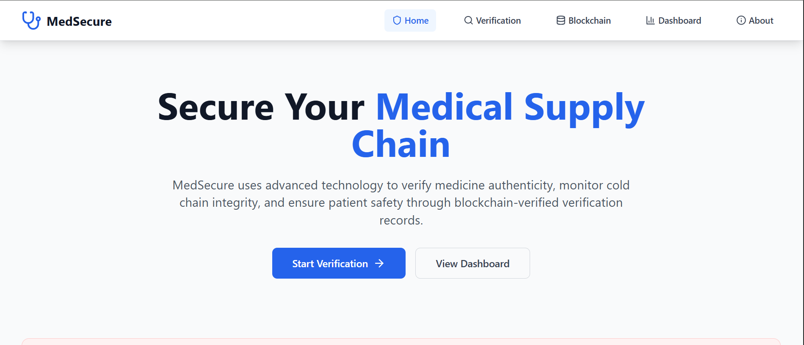
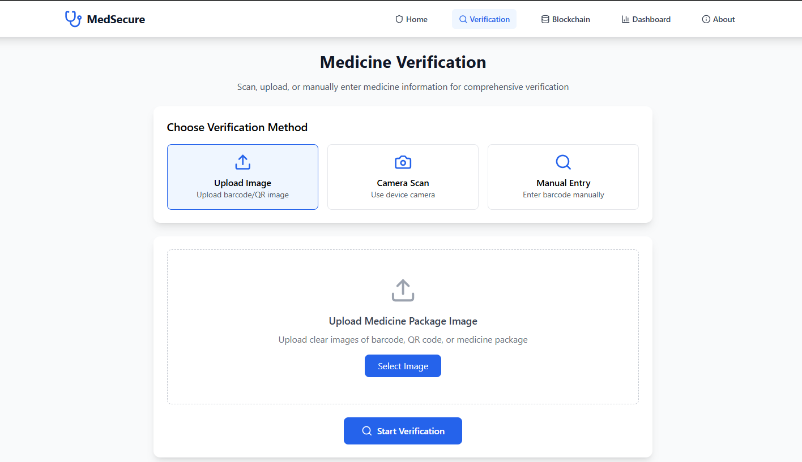
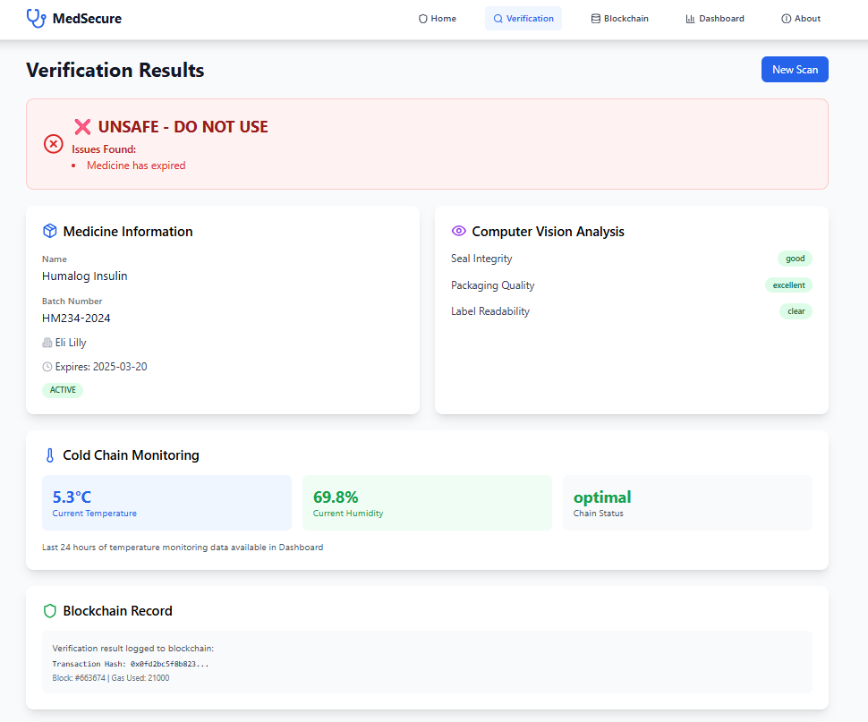
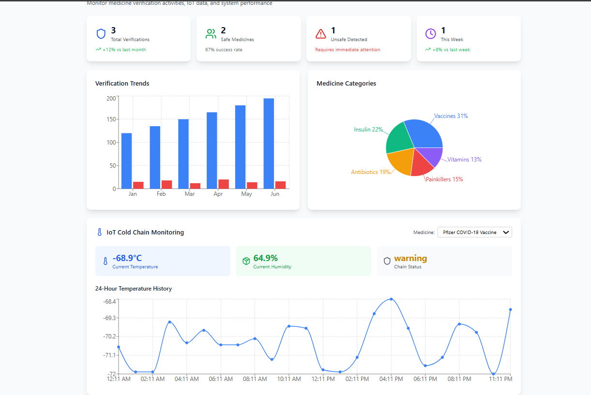

## 🏥 MedSecure – AI + Blockchain Powered Medicine Verification System

MedSecure is a secure, AI-powered platform designed for hospitals and pharmacies to ensure medicine authenticity, quality, and compliance. By combining IoT sensors, Computer Vision (CV), OCR, and Blockchain, MedSecure prevents counterfeit drugs, spoiled vaccines, and supply chain fraud.

## 🚀 Features

* IoT Integration → Monitors cold chain integrity (temperature, humidity) for vaccines, insulin, and critical medicines.
* Computer Vision (CV) → Detects damaged packaging, broken seals, and visual anomalies.
* OCR & Barcode/QR Scanning → Verifies expiry dates, batch numbers, and product codes.
* Blockchain Ledger → Stores verification logs as tamper-proof records for regulatory compliance.
* Dashboard → Hospitals can view medicine authenticity, shipment integrity, and real-time alerts.

## 🛠️ Tech Stack

* Frontend → React.js / Next.js (Dashboard UI)
* Backend → Node.js / Express.js (API Integration)
* Database → MongoDB (Medicine + User Data)
* IoT Simulation → Python + MQTT (Cold Chain Monitoring)
* Computer Vision → OpenCV (damage/seal detection)
* OCR → Tesseract.js / EasyOCR (text, barcode, QR recognition)
* AI/ML → TensorFlow / PyTorch (future scope: anomaly detection, predictive analytics)
* Blockchain → Ethereum / Hyperledger / Polygon (for verification logs)
* Cloud → AWS / Azure / Cloudflare (deployment & scalability)

## Screenshot

Verification:

Dashboard: 

## 📂 Project Workflow

*Medicine Shipment Arrives → IoT sensors track temperature & humidity.
*Computer Vision + OCR Check → Detects seal integrity, reads expiry, batch number, barcode/QR.
*Mock Database Verification → Cross-checks against approved medicine records.
*Blockchain Logging → Stores verification results securely & immutably.
*Hospital Dashboard → Displays status: ✅ Verified / ❌ Rejected.

## 🎯 Impact

* For Hospitals → Prevents counterfeit & spoiled medicines, ensures compliance, saves costs.
* For Pharmacies → Builds trust with patients, reduces returns & complaints.
* For Patients → Safer treatments, reduced risks from fake/expired medicines.

## 🔮 Future Scope

* Deep Learning Models → Smarter anomaly & damage detection.
* Predictive Analytics → Forecast spoilage & inventory risks.
* Integration with National Drug Registry → Large-scale adoption for healthcare regulation.
* Mobile App Version → Quick scan & verify feature for pharmacists.

## ⚡ Quick Start
* 1. Clone the repo
git clone https://github.com/Aman7Raj/MedSecure.git
cd MedSecure

* 2. Install dependencies
npm install   # for frontend/backend
pip install -r requirements.txt   # for IoT + CV modules

* 3. Run the project
npm start         # Run frontend/backend
python iot.py     # Simulate IoT sensor data
python cv_ocr.py  # Run CV + OCR checks

## 📌 Contribution

Contributions are welcome! Fork the repo, open issues, or submit PRs.

## 📜 License

This project is licensed under the MIT License.
